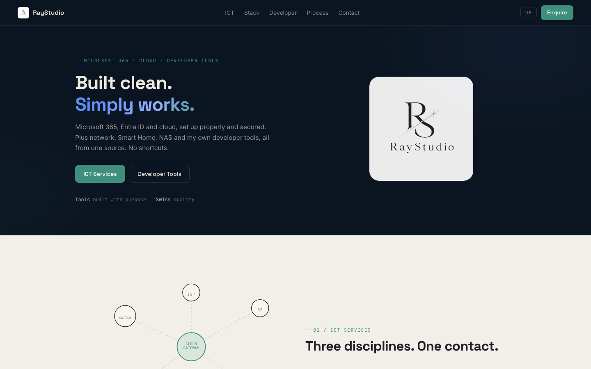

  
  <h1>RayStudio</h1>

[🇬🇧 English Version](README.md)

**Der Quellcode von [raystudio.ch](https://raystudio.ch), wo die Tools aus diesem Account vorgestellt werden.**

Die Seite selbst ist die Sache; dieses Repository ist das, woraus sie gebaut
wird. Eine statische GitHub-Pages-Seite, deutsch und englisch, ausgeliefert
durch einen Push auf den Standardbranch.

**Nichts für dich, wenn** du wegen der Tools hier bist. Die liegen in den
übrigen Repositories dieses Accounts, oder auf der Seite selbst, die sich
leichter liest als eine Repository-Liste.

---

## Projekte

Alle Open-Source-Tools von RayStudio:

### Desktop-Apps (Rust + Tauri)

| Tool | Beschreibung |
|---|---|
| [StateForge](https://github.com/9t29zhmwdh-coder/StateForge) | Visueller State-Machine-Builder mit lokaler KI-Unterstützung |
| [LifePlanner](https://github.com/9t29zhmwdh-coder/LifePlanner) | Offline KI-Lebensplaner: Termine, Aufgaben, Fristen |
| [DeviceHealth](https://github.com/9t29zhmwdh-coder/DeviceHealth) | KI-gestützte offline Systemdiagnose mit Health-Score |
| [CleanFlow](https://github.com/9t29zhmwdh-coder/CleanFlow) | KI-gestützter Dateiorganisator |
| [LifeSort](https://github.com/9t29zhmwdh-coder/LifeSort) | KI-gestützter Dateiorganisator: Sortieren, Duplikate, Aufräumen |
| [BugRadar](https://github.com/9t29zhmwdh-coder/BugRadar) | Echtzeit-Log-Analyse und Incident-Erkennung |
| [LogLens](https://github.com/9t29zhmwdh-coder/LogLens) | KI-gestützte Log-Suche und Root-Cause-Analyse |
| [MailLoom](https://github.com/9t29zhmwdh-coder/MailLoom) | Lokaler KI-Mail-Organizer: offline Kategorisierung, IMAP-Sync |
| [ClarityDesk](https://github.com/9t29zhmwdh-coder/ClarityDesk) | Universeller Bildschirm-Interpreter mit OCR und lokaler KI |

### Windows (.NET / WPF)

| Tool | Beschreibung |
|---|---|
| [NetDashboard](https://github.com/9t29zhmwdh-coder/NetDashboard) | Netzwerk- & Mail-Diagnose-Toolkit mit M365/Exchange-Online-Support |
| [NetSweep](https://github.com/9t29zhmwdh-coder/NetSweep) | Speicher-Audit & Bereinigung: NAS, SharePoint, OneDrive, DFS |
| [WorkplaceAssessment](https://github.com/9t29zhmwdh-coder/WorkplaceAssessment) | Offline Windows-Gerätecheck und Windows-11-Bereitschaftsscanner |

### macOS / Apple Silicon

| Tool | Beschreibung |
|---|---|
| [CodeWhisper](https://github.com/9t29zhmwdh-coder/CodeWhisper) | macOS-KI-Codeassistent mit NSServices-Integration für Xcode |
| [SiliconMark](https://github.com/9t29zhmwdh-coder/SiliconMark) | Apple Silicon LLM Benchmark Suite |
| [EmissaryKit](https://github.com/9t29zhmwdh-coder/EmissaryKit) | Swift Agent Framework für lokale LLMs |
| [private-model-orchestrator](https://github.com/9t29zhmwdh-coder/private-model-orchestrator) | KI-Modellverwaltung über Apple-Geräteflotten |

### Microsoft 365 / Azure / Entra ID Security

| Tool | Beschreibung |
|---|---|
| [agent-governance-console](https://github.com/9t29zhmwdh-coder/agent-governance-console) | Governance- und Audit-Toolkit für KI-Agent-Workflows |
| [entra-access-graph-engine](https://github.com/9t29zhmwdh-coder/entra-access-graph-engine) | Bildet Entra-ID-Objekte auf einen Privilege-Access-Graph ab |
| [entra-least-privilege-analyzer](https://github.com/9t29zhmwdh-coder/entra-least-privilege-analyzer) | Findet überprivilegierte Konten, Rollen-Überschneidungen, PIM-Lücken |
| [azure-policy-drift-detector](https://github.com/9t29zhmwdh-coder/azure-policy-drift-detector) | Erkennt Azure-Policy-Drift über Subscriptions hinweg |
| [azure-cost-forecasting-engine](https://github.com/9t29zhmwdh-coder/azure-cost-forecasting-engine) | Analysiert und prognostiziert Azure-Kosten |
| [github-actions-security-sandbox](https://github.com/9t29zhmwdh-coder/github-actions-security-sandbox) | Statische Analyse und Angriffssimulation für GitHub-Actions-Workflows |

### Plattformübergreifend / Netzwerk

| Tool | Beschreibung |
|---|---|
| [NetFathom](https://github.com/9t29zhmwdh-coder/NetFathom) | Plattformübergreifendes Netzwerk-Discovery-Toolkit |
| [eventhub-otlp-mapper](https://github.com/9t29zhmwdh-coder/eventhub-otlp-mapper) | Bildet Azure-EventHub-Nachrichten auf OpenTelemetry ab |

### Web / Self-Hosted

| Tool | Beschreibung |
|---|---|
| [HomePortal](https://github.com/9t29zhmwdh-coder/HomePortal) | Schlankes selbst gehostetes persönliches Webportal |
| [GardenFlow](https://github.com/9t29zhmwdh-coder/GardenFlow) | Modulares Garten-Automatisierungs-Toolkit: MQTT, Sensoren, Dashboard |

Alle Repos folgen denselben öffentlichen **[Engineering-Standards](https://github.com/9t29zhmwdh-coder/engineering-standards)**.

---

**Author:** [Rafael Yilmaz](https://github.com/9t29zhmwdh-coder) · **Status:** Active · **Last Updated:** Juli 2026

## Quellenangaben

Die Linux-Kachel verwendet den Pinguin Tux von Larry Ewing, Simon Budig und Garrett LeSage (frei nutzbar mit Namensnennung). Namen und Bilder von Windows, Apple, AdGuard, Home Assistant und UniFi gehören ihren Inhabern und werden nur gezeigt, um unterstützte Plattformen und Produkte zu benennen.
