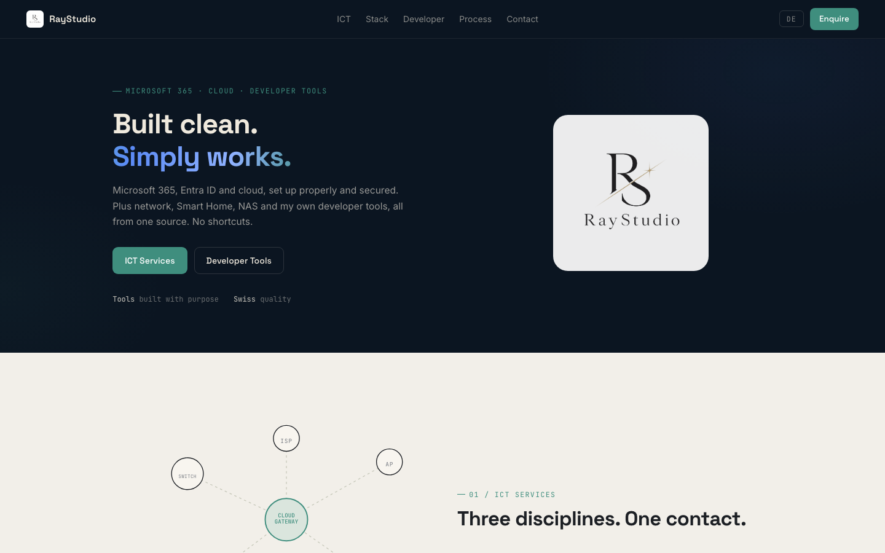

  
  <h1>RayStudio</h1>

**RayStudio: Portfolio & Developer Tools · raystudio.ch**

Personal portfolio and tooling showcase by Rafael Yilmaz. Built as a GitHub Pages site.

---

## Projects

A selection of open-source tools built by RayStudio:

| Tool | Description |
|---|---|
| [LifePlanner](https://github.com/9t29zhmwdh-coder/LifePlanner) | Offline AI life planner: events, tasks, deadlines |
| [DeviceHealth](https://github.com/9t29zhmwdh-coder/DeviceHealth) | System diagnostics with health score |
| [CleanFlow](https://github.com/9t29zhmwdh-coder/CleanFlow) | AI-powered file organizer |
| [BugRadar](https://github.com/9t29zhmwdh-coder/BugRadar) | Real-time log analysis and incident detection |
| [LogLens](https://github.com/9t29zhmwdh-coder/LogLens) | AI-powered log search and root-cause analysis |
| [NetScanX](https://github.com/9t29zhmwdh-coder/NetScanX) | Cross-platform network discovery toolkit |
| [SiliconMark](https://github.com/9t29zhmwdh-coder/SiliconMark) | Apple Silicon LLM benchmark suite |
| [SwiftAgent](https://github.com/9t29zhmwdh-coder/SwiftAgent) | Swift agent framework for local LLMs |

See all tools at **[raystudio.ch](https://raystudio.ch)**

---

**Author:** [Rafael Yilmaz](https://github.com/9t29zhmwdh-coder) · **Status:** Active · **Last Updated:** Juni 2026
